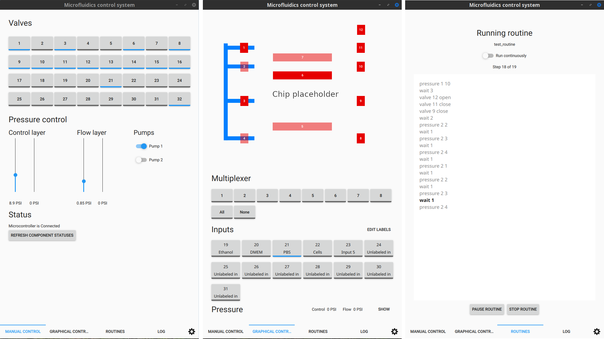
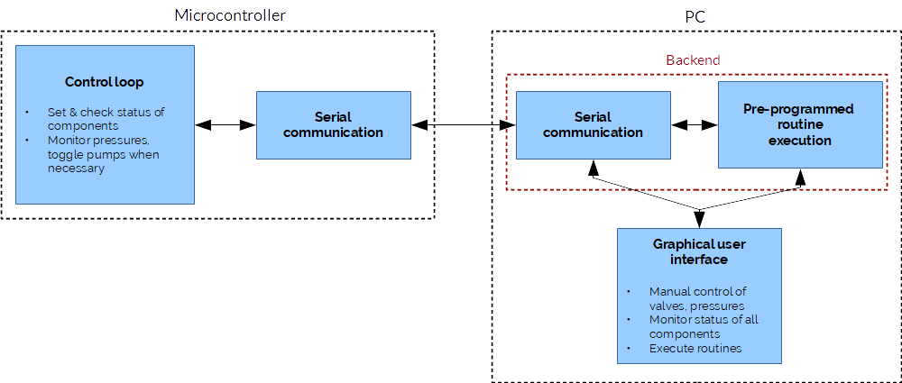

# μFCS-PC

Part of the microfluidics control system. See the [Hackaday.io page](https://hackaday.io/project/27511-microfluidics-control-system) and the [HardwareX paper](https://www.sciencedirect.com/science/article/pii/S2468067218301147) for more details.

## Supported platforms

This application is intended to be cross-platform and compatible with Windows, Linux, macOS, Android and iOS. It makes heavy use of Qt libraries to do so.

Unfortunately, some aspects of Qt are not fully cross-platform. The serial communication libraries, for example, are not compatible with "normal" (un-rooted) versions of Android, and the Bluetooth libraries do not work with Windows. Therefore, full compatibility with all platforms is not guaranteed. 

So far, the application has been used on Windows and Linux with the microcontroller connected via USB. Some brief tests have been done on Linux and Android to verify that bluetooth worked there.

## Building

The only prerequisite to build the application should be Qt 5. The application has been developed for Qt 5.14, but should also work with earlier versions. 

To build the application, simply clone or download this repository and either build it using the Qt Creator IDE, or by running

    qmake ufcs-pc.pro
    make

(replace `make` by `nmake` for Windows)

## Project organisation

First, consider the overall structure of the microfluidics control system software:

It is divided into two main parts: the microcontroller and the host (PC or other device). The two communicate via a simple serial protocol, transmitted either over USB or Bluetooth.

On the host side, the software can be broken down into three main components: the serial communication module; the routine module, which sends pre-programmed protocols to the microcontroller; and the graphical user interface, which lets the user access both manual control and routine running.

The graphical user interface is based on Qt Quick, which uses the QML markup language. The rest of the code is C++. As much of the functionality as possible was written in C++, so that the QML parts would focus almost entirely on the UI design.

Overall, the code follows an object-oriented approach where each functional unit is represented as a class. For example, the `SerialCommunicator` class handles all serial communication, and offers high-level functions to update the state of valves, pumps etc. that are used both by the `RoutineController` and `ApplicationController` classes. The former of these handles routines, while the latter handles most of the application and communicates with the UI elements.

This approach intends to make it easy to understand how different parts of the application fit together, and to make it relatively painless to update any one part without having to touch other parts. 

## Deploying
_AKA creating an installer_

### Android
A .apk package is built by Qt Creator when building a project for Android. Not much else is needed, really.

### Windows
Deployment scripts (to build a release version, and create an installer) are in the `deploy` folder.

On top of the requirements for Qt (to simply build the app), you will need:

 - the [Build Tools for Visual Studio 2017](https://visualstudio.microsoft.com/downloads/#build-tools-for-visual-studio-2017)
 - [Inno Setup 5](http://jrsoftware.org/isdl.php#stable)

Adjust the paths as needed in `deploy_windows.bat` to point towards your Qt, Visual Studio Build Tools and Inno Setup installations, then run it. An installer will be created in `build/installer`.

## Customizing the code to your hardware setup

The PC part of the code has very little knowledge of the actual hardware connected to the microcontroller. It does not concern itself with whether a pressure regulator is analog or digital, where it is connected, or what types of valves are connected to what pins, for example.

The few aspects that you may need to customize are the number of valves and pressure regulators, and the bounds (maximum and minimum pressure) of each pressure regulator. Most, if not all, aspects related to the specific hardware setup are defined in QML, so the C++ side should not need to be edited to customize the application to your setup.

The valves are defined in `src/qml/ManualControl.qml`. By default, the screen is divided into panes for the "flow layer" and "control layer", since we use two different pressure levels for different layers of our microfluidic chip. So here, each pane has a `PressureController` item and several `ValveSwitch` items.

Both of these are initialized with only a number. By default, the valve numbers correspond to the actual markings on the PCB. Switching Valve number 1 on in the PC software will transmit that same information to the microcontroller, which then relates this to the pin that the valve is connected to.

Valve Switches are buttons that make it possible to turn valves on and off, and display their current state. They are defined like so:

    ValveSwitch { valveNumber: 1 }

(See `ManualControl.qml`). If you wish to add or remove valves, simply edit these lines. You only need to specify a valve here for it to be available to the rest of the program. 

Pressure controllers are defined similarly, and also include a minimum and maximum pressure in PSI:

    PressureController {
        controllerNumber: 1
        minPressure: 0
        maxPressure: 29.5
    }

The pressure defined here is used in the user interface, and in RoutineController's error-checking code. Behind the scenes, only values between 0 and 255 are sent to and from the microcontroller. The controller number, however, should match the one defined in the microcontroller code.

## Graphical control
In v2, a graphical control screen was added, that includes an image of the microfluidic chip with clickable valves, as well as other chip-specific functions. This is disabled by default since it is specific to a particular microfluidic chip. It can be enabled in the settings.

Enabling graphical control offers the user a choice of source file for the graphical control screen -- in case several different chips are to be controlled with the same setup, it is possible to switch between them without recompiling the application.

The source files (and associated labels that are displayed in the drop-down box in the settings) are specified in the settings file. On Linux, you can find this file at `$HOME/.config/ufcs/ufcs-pc.conf`.
 
To add a .qml file to be used, add it under `[graphicalControl]` like so:

    [graphicalControl]
    sources\CustomChip=file:/absolute/path/to/file/CustomChipControl.qml

Here, the `CustomChipControl.qml` file will be loaded, and the label displayed in the drop-down menu in settings will be `CustomChip`.
